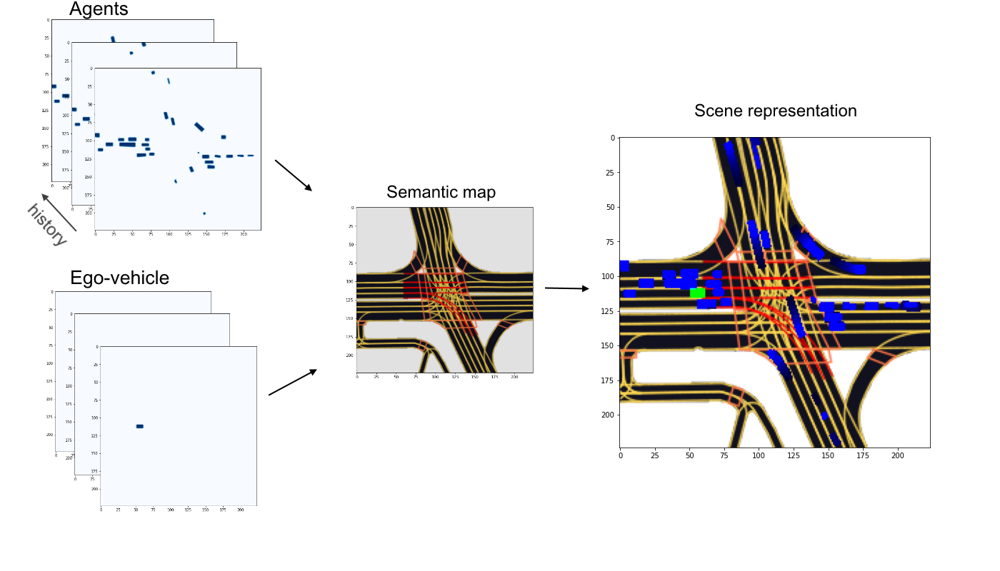

# Lyft motion prediction

This repository contains pretrainded models for motion prediction based on Lyft Level 5 Prediction.

## Dataset:

Dataset consists of more then 1000 hours of data collected by a fleet of 20 autonomous vehicles along a fixed route in Palo Alto.
Data about self-driving vehicle and other traffic participants represented in chunks with 25 seconds duration.
Also high-definition semantic map and high-resolution aerial picture are provided.

* Download dataset:
https://self-driving.lyft.com/level5/data/

* Paper about dataset:
https://arxiv.org/pdf/2006.14480.pdf

* Official development tools for the dataset:
https://github.com/lyft/l5kit/
