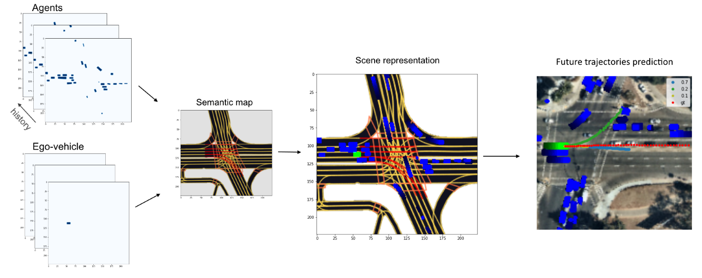
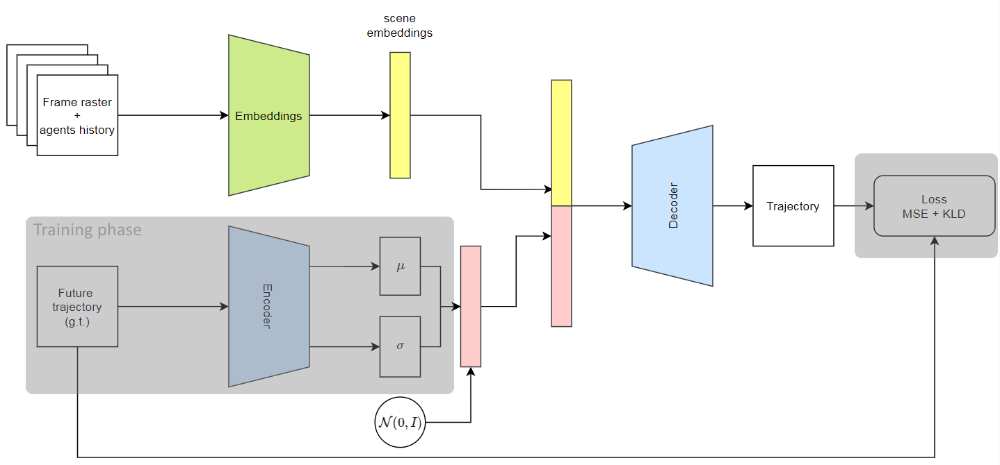
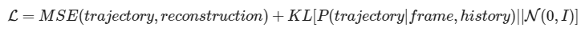
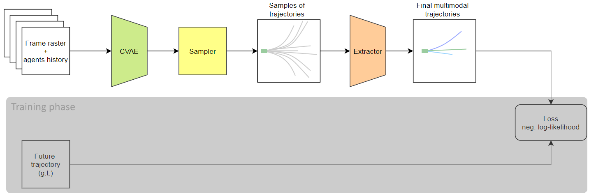
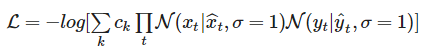

# Lyft motion prediction

This repository contains pretrainded models for the motion prediction task based on Lyft Level 5 Prediction dataset.  
Complete model utilizes BEV-semantic map of the frame with agents histories and predict multi-modal future trajectories of agent for next 5 seconds with frequency 10Hz. 

## Examples:
Training and prediciton of models provided with examples in notebooks:
 * [Train example.](https://github.com/kumgleb/Lyft_motion_prediction/blob/main/examples/train_example.ipynb)
 * [Prediction example](https://github.com/kumgleb/Lyft_motion_prediction/blob/main/examples/prediction_example.ipynb)

## Models:
Complete model consist of two stages:
* CVAE-based model that learns a distribution P(trajectory | frame, history)

Loss function:  
  
Also maximum mean discrepancy loss is supported and can be used to train the model.
* Extractor model based on CVAE model and extract multi-modal prediction for given future trajectories probabilities:

Ground truth assumed to be a mixture of multi-demensional independent Normal distributions over time.
Loss function:  

## Dataset:
Dataset consists of more then 1000 hours of data collected by a fleet of 20 autonomous vehicles along a fixed route in Palo Alto.
Data about self-driving vehicle and other traffic participants represented in chunks with 25 seconds duration.
Also high-definition semantic map and high-resolution aerial picture are provided.

* Download dataset:
https://self-driving.lyft.com/level5/data/

* Paper about dataset:
https://arxiv.org/pdf/2006.14480.pdf

* Official development tools for the dataset:
https://github.com/lyft/l5kit/

